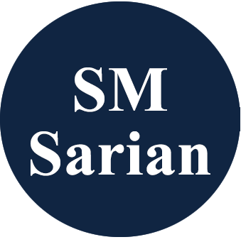

## About Sarian Shop_de

The Sarian Shop is a Laravel website, developed exclusively for German-language portfolio. The information entered in the database is fake data for the bicycles field. This site is only designed as a work sample, it is intended only for employers and companies that I have sent a job application to. In any case, it will be an honor for me if you check my portfolio and the codes. Also you can check online the website : www.smsarian.ir

## Requirements

| Name              | Version      |
|-------------------|--------------|
| Composer          | V2.5.8+      |
| Php               | V8.1+        |
| Laravel           | V10.10+      |
| Laravel/ui        | V4.2+        |
| Bootstrap         | V5.2.3+      |
| Vite              | V4.0.0+      |
| Darryldecode/cart | V4.2.3+ |
| CKEDITOR          | V4.12.1 |
| Mysql             | V8.2.4+ |

## Installation

1.	**Clone or download this repo**
2.	**Download database file in root directory and the name is shop_de.sql. Create a database named shop_de and import the file.**
3.	**Run XAMPP or any other cross-platform Web Server**
4.	**Install PHP dependencies** 
composer install
5.	**Generate key** 
php artisan key:generate
6.	**Share Storage folder** 
php artisan storage:link
7.	**install front-end dependencies** 
composer require laravel/ui  
php artisan ui:auth  
php artisan ui bootstrap  
npm install  
npm run dev  
8.	**Run migration**
php artisan migrate
9.	**Run server**
php artisan serve
10.	**Visit localhost:8000 in your browser**
11.	**Login to the admin panel : login in the site**  
Username: admin@email.com  
Password: Qazwsx*123  
Panel url: http://127.0.0.1:8000/home  

**Please let me know if you have any problem.**

## License

Sarian Shop_de application under the MIT license.
